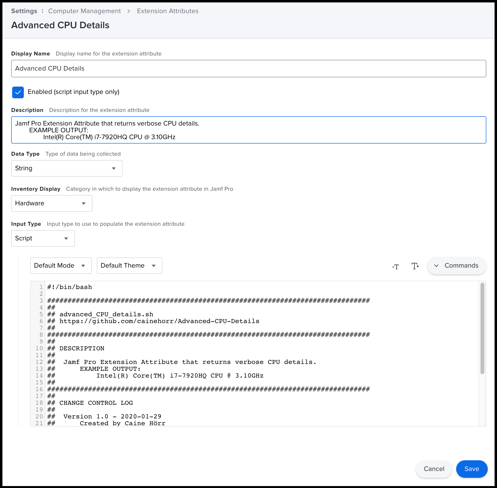
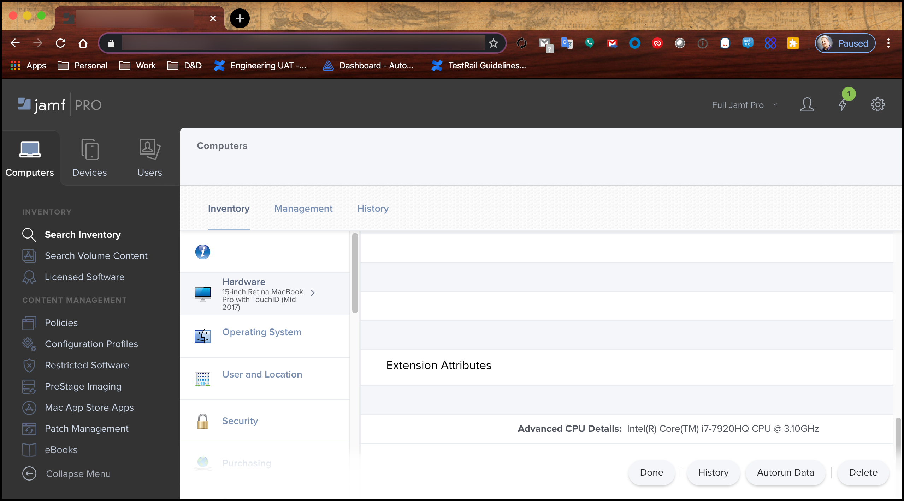

# Advanced-CPU-Details
Jamf Pro Extension Attribute that returns verbose CPU details.

## COMPATIBILITY
[MACOS-COMPATIBILITY.md](MACOS-COMPATIBILITY.md)

## EXAMPLE OUTPUT
```Intel(R) Core(TM) i7-7920HQ CPU @ 3.10GHz```

## CONFIGURATION
1. Log into your Jamf Pro tenant
2. Navigate to **_Settings_** (Gear Icon)
3. Navigate to **_Computer Management_**
4. Click on the **_Extension Attributes_** icon
5. Click on the **_+ New_** button
6. Set **_Display Name_** to ```Advanced CPU Details```
7. Select the **_Enabled_** checkbox
8. Set **_Data Type_** to ```String```
9. Set **_Inventory Display_** to ```Hardware```
10. Set **_Input Type_** to ```Script```
11. Copy/Paste [advanced_CPU_details.sh](advanced_CPU_details.sh) into the script field
12. Click on the **_Save_** button



## OUTPUT - COMPUTER RECORD

